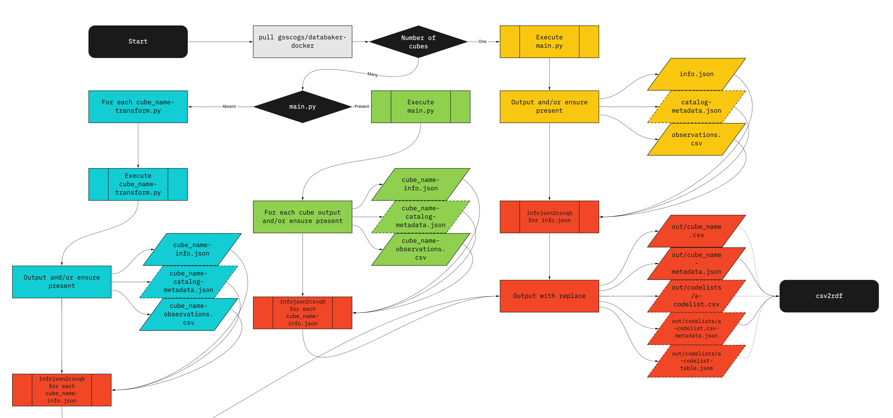

# Naming convention
A naming convention is required for the Jenkins pipeline to handle our new `csvwlib` tooling (i.e. csvws are now generated using a command line utility).



The generic steps of a data pipeline
1. Download data from a defined source
2. Record source information (e.g. metadata)
3. Transform data into tidy data
4. Output data in specified formats

The previous way `gss-utils` and Jenkins handed responsibilities for these actions was the file `main.py` was run by Jenkins and this python script provided the csvw outputs in `./out/` using the `Cubes.output_all()` method from `gss-utils`. The only mandatory file in a dataset's directory was the `main.py`, and the `info.json` was not required.

The new `infojson2csvqb` command line utility is stand alone and not executed from the python script, it will be a separate Jenkins step. `infojson2csvqb` requires `info.json` and `observations.csv` to output csvw. The `cube_name-catalog-metadata.json` files are optional, and provide details on such as the data publisher, categories, descriptions, and other provenance information.

With these requirements, a naming convention is required to permit a procedural generation of csvqb for onwards serialisation into rdf.

## Transformation types
The base unit of csvw generation by `infojson2csvqb` is a single cube. The previous way `gss-utils` handled generation of csvws is that multiple cubes could be generated using the pipeline. Now the pipeline will check for the following.

### Single cube single python files
Single cube transforms require an `info.json` and an `observations.csv`, the latter of which is generated by `main.py`. For the optional catalog-metadata information, the `Scraper` class's `as_csvqb_catalog_metadata()` returns the Scraper's metadata as a `CatalogMetadata` object. The `CatalogMetadata` object then finally has a method `to_json_file("catalog-metadata.json")` to output the file. The command to create the resulting csvw executed by Jenkins follows.

```
infojson2csvqb build -c info.json -m catalog-metadata.json observations.csv
```

### Multi-cube single python files
Multi-cube single python transforms start by executing the `main.py`. For each cube desired, a corresponding `[cube_name]-info.json` and `[cube_name]-observations.csv` must be output co-located to `main.py`. Optionally the CatalogMetadata can be created with the name `[cube_name]-catalog-metadata.json`. This naming convention allows for the pipeline runtime to generate all csvqbs.

One drawback to this single python file approach is that it is not fully suited for parallelism between the stages, and that the python script must output all cubes before the pipeline can continue to the next step.

Briefly, for a given cube_name (use snake case).
* `main.py` is executed
* And for each cube
  * `cube_name-info.json` must be present
  * `cube_name-observations.csv` must be present
  * Optionally: `cube_name-catalog-metadata.json`

### Multi-cube multi python files
Multi-cube multi python files are named in a similar fashion to multi-cube single python files; however if `main.py` is present it is executed first to support the generation of common codelists.

Briefly, for a given cube_name (use snake case).
* Optionally: `main.py` is executed
* And for each cube
  * `cube_name-transformation.py` is executed
  * `cube_name-info.json` must be present
  * `cube_name-observations.csv` must be present
  * Optionally: `cube_name-catalog-metadata.json`